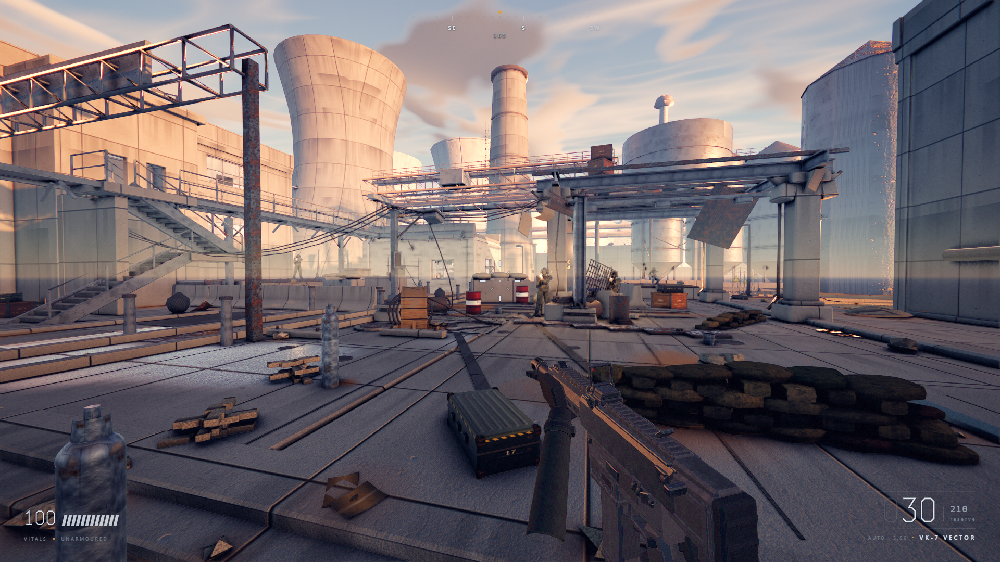

# BLACKSITE

### ▶ [Play it in your browser](https://javieranta.github.io/blacksite/)

A first-person shooter built in Three.js / WebGL2, with **zero external assets** —
every texture, mesh, animation and sound is generated procedurally in code at
load time. No downloaded models, no sample libraries, no licensing surface.

> **First load takes 30–60 seconds.** Roughly 175 shader programs are compiled up
> front — deliberately, behind the boot screen — and every texture is generated
> rather than downloaded. That pre-warm is what stops the first minute of play
> being a series of 700ms stalls. Subsequent loads are faster once the cache is warm.
> Needs a desktop browser with WebGL2 — Chrome or Edge give the best results.
> Click the canvas to capture the mouse; press Esc to release it.



---

## Status: honest version

The stated goal was "Call of Duty quality". **It is not there.** The most recent
graded review scored it **61/100**, up from 9 at the first blockout.

What that means in practice: the environment art, material authoring and lighting
now hold up respectably — the reviewer's per-shot scores put environment-only
frames at 60–68 — but the first-person weapon sits at 42–54 and the night preset
at 44. Hero assets are where a strictly procedural approach hits its ceiling.

See [docs/Status.md](docs/Status.md) for the full review, every open defect, and
the measurement problems that repeatedly produced confident wrong answers.

### What genuinely works

| | |
|---|---|
| **Performance** | 7.9ms at cinematic 1920×1080 on an RTX 5090 (~127fps); 58–62fps across all 13 canonical views |
| **Lighting** | Cast shadows at every sun angle including grazing low sun; ambient occlusion correctly scoped to the ambient term |
| **Warm-up** | Peak first-minute CPU hitch cut from 742ms to 32ms by pre-linking 175 shader programs behind the boot screen |
| **Ballistics** | Energy-based penetration with back-face thickness probing — 5.56 defeats a 50mm plank, stops on 50mm concrete |
| **Weapons** | Three distinct rigs on 1/2/3: compact SMG, rifle, marksman rifle |
| **Grenades** | Cook, arc, bounce, line-of-sight-checked blast |
| **Traversal** | Stairs, ramps, mantles and caged ladders, up and down — 17 of 20 asserted routes |
| **Audio** | Fully synthesised WebAudio: layered gunshots, distance filtering, convolution reverb per zone |
| **HUD** | Compass, vitals, ammo with fire mode, kill feed, grenade count, F3 perf readout |

### What is broken

- **Night preset is sunset lighting with a night sky swapped in** — a warm directional casts hard shadows under a starfield. Worst frame at 44.
- **Floating props** — eight rounds unresolved.
- **Large featureless floor and wall expanses** — the reviewer's highest-leverage remaining fix.
- **Worst-frame spikes** of 35–50ms against a 16.7ms mean, never diagnosed.
- Three stairs remain unclimbable (plant deck switchback, west hall mezzanine, admin block tower), and Props scatters into a keep-clear volume.

## Quick start

```bash
npm install
npm run dev
```

Then open <http://127.0.0.1:5180>. Click to capture the pointer.

**Controls** — WASD move · Shift sprint · Ctrl/C crouch · Space jump · Left click
fire · Right click ADS · R reload · B fire mode · **1/2/3 weapons** · **G grenade** ·
Q/E lean · **F3 perf readout** · Esc pause. Ladders: face one and hold W.

## The screenshot rig

```bash
node tools/shoot.mjs                    # all 13 canonical views
node tools/shoot.mjs --views hero-golden,combat --tag mywork
node tools/shoot.mjs --list
```

`tools/shoot.mjs` drives the running dev server headlessly through Playwright
with **real GPU rasterisation** (`--use-angle=d3d11`). It writes PNGs plus a
`report.json` containing per-view FPS, draw calls, triangle counts and any page
errors — and exits non-zero if the build logged an error, so a broken build
cannot report itself clean.

This works because the app exposes deterministic URL parameters:

| Parameter | Effect |
|---|---|
| `?freeze=1` | hold simulation time |
| `?tod=golden` | time of day (`dawn morning midday golden dusk night overcast`) |
| `?pos=x,y,z&yaw=&pitch=` | place the camera |
| `?hud=0` / `?vm=0` | hide HUD / viewmodel |
| `?ads=1` / `?fire=1` | force weapon poses |
| `?quality=cinematic\|high\|medium\|low` | quality preset |

## How this was built

The codebase was written by AI agents working in parallel — typically 5–12 at a
time, each owning a disjoint set of files — under a critique loop:

```
build → integrate → screenshot → hostile visual review → route defects to owners → repeat
```

The reviewer is a separate agent that only sees rendered PNGs, is explicitly
forbidden from grading on a "good for a browser" curve, and must audit each
previously-raised defect for whether it *visibly landed in the image*. That
constraint mattered: several rounds produced modules containing a shadow system,
an AO pass and a TAA resolve while the rendered frame showed none of them. Code
existing is not the same as an effect landing, and only the screenshot can tell
you which one you have.

[CONTRACT.md](CONTRACT.md) is what made parallel authorship survivable: one
owner per file, no system importing another, all communication through a system
registry and a frozen event bus.

## Documentation

- **[docs/Resuming.md](docs/Resuming.md)** — start here if you are picking this up cold
- **[docs/Status.md](docs/Status.md)** — full review, open defects, and the measurement problem
- **[docs/Architecture.md](docs/Architecture.md)** — runtime topology, systems, seams
- **[docs/VR.md](docs/VR.md)** — the WebXR port plan: obstacles, phase order, testing
- **[CONTRACT.md](CONTRACT.md)** — the binding rules for working in this codebase
- **[tools/workflows/](tools/workflows/)** — the agent briefs and critic prompts that built it

## Constraints

| | |
|---|---|
| Draw calls | ≤ 900 |
| Triangles | ≤ 3.5M |
| Frame rate | 60fps @ 1080p |
| External assets | none — everything procedural |
| Allocation | none in `update()` / `fixedUpdate()` hot paths |

## Licence

MIT. All content is original and generated in code; there are no third-party
assets to attribute.
